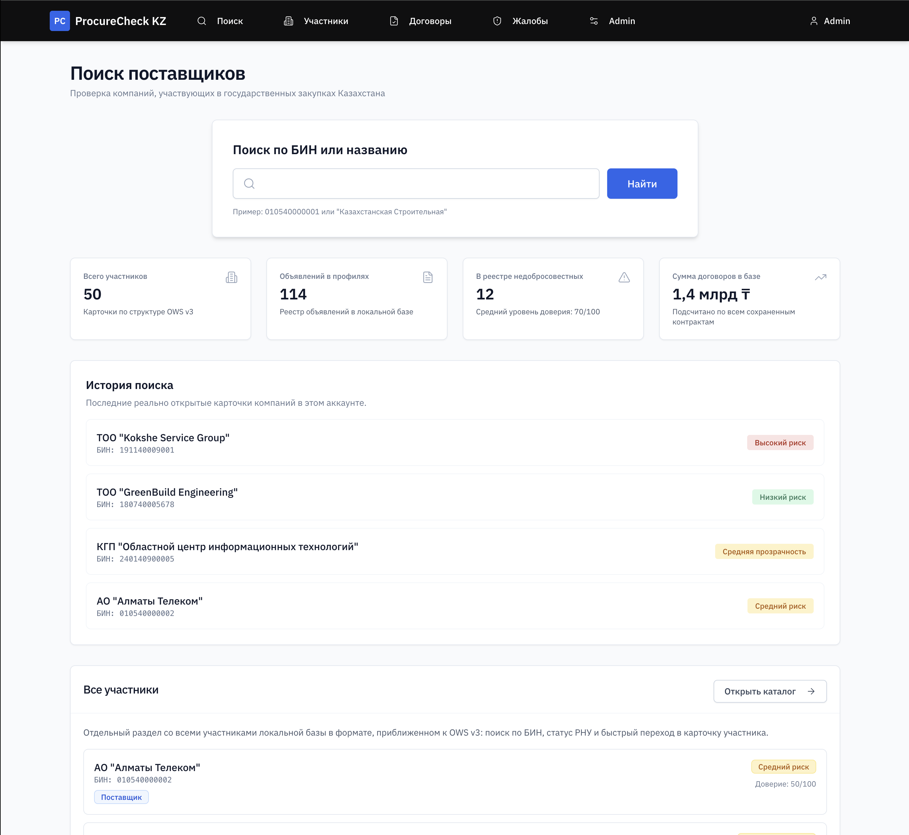

# ProcureCheck KZ

[](https://procurecheck-kz.vercel.app)
[](https://procurecheck-kz.onrender.com/docs)
[](https://github.com/argamegg/procurecheck-kz)

ProcureCheck KZ — это веб-платформа для анализа участников государственных закупок Казахстана. Проект объединяет реестры, карточки участников, ролевую аналитику и административную панель управления demo-данными в одном интерфейсе.  
Система моделирует реальную логику госзакупок: поставщиков, заказчиков, договоры, заявки, жалобы, РНУ и аналитические индикаторы.

## 

## Основные возможности

- Поиск участников по БИН/ИИН и названию
- Профиль участника с разделами: участник, объявления, заявки, лоты, договоры, акты, жалобы, РНУ, аналитика
- Реестры участников, договоров и жалоб
- Supplier Trust Score для поставщиков
- Customer Transparency Score для заказчиков
- Admin Panel для управления demo-данными и параметрами аналитики
- Ролевой доступ: `admin` и `user`

## Технологический стек

### Backend
- FastAPI
- MongoDB + Motor
- JWT auth
- Pydantic

### Frontend
- React
- Tailwind CSS
- shadcn/ui
- Recharts
- Axios

### Инфраструктура
- MongoDB Atlas
- Render
- Vercel
- UptimeRobot
- Docker / Docker Compose

## Архитектура деплоя

- **MongoDB Atlas** — основная база данных
- **Render** — размещение backend API и Swagger-документации
- **Vercel** — размещение frontend
- **UptimeRobot** — мониторинг доступности backend через `/health`

## Демо-аккаунты

| Роль | Email | Пароль |
|---|---|---|
| Администратор | `admin@procurecheck.kz` | `demo123` |
| Пользователь | `user@procurecheck.kz` | `demo123` |

## Быстрый старт через Docker

```bash
cp .env.example .env
docker compose up --build
```

После запуска:

- frontend: [http://localhost:3000](http://localhost:3000)
- backend docs: [http://localhost:8001/docs](http://localhost:8001/docs)

Для development-режима с hot reload:

```bash
docker compose -f docker-compose.dev.yml up --build
```

## Быстрый старт локально без Docker

### 1. Backend

```bash
cd backend
python3 -m venv venv
source venv/bin/activate
pip install -r requirements.txt
uvicorn server:app --host 0.0.0.0 --port 8001 --reload
```

### 2. Frontend

```bash
cd frontend
yarn install
yarn start
```

Приложение будет доступно по адресам:

- frontend: [http://localhost:3000](http://localhost:3000)
- backend docs: [http://localhost:8001/docs](http://localhost:8001/docs)

## API-документация

- Production: [https://procurecheck-kz.onrender.com/docs](https://procurecheck-kz.onrender.com/docs)
- Local: [http://localhost:8001/docs](http://localhost:8001/docs)

Ключевые группы API:

- `auth` — авторизация
- `companies` — поиск, каталог и профиль участника
- `contracts` — реестр и детальная карточка договора
- `complaints` — реестр жалоб
- `participants/{bin}/trust-score` — единый расчет аналитики участника
- `admin/*` — CRUD по demo-данным и настройки формулы

## Структура проекта

```text
procurecheck-kz/
├── backend/
│   ├── data/                 # Локальные demo-данные и настройки аналитики
│   ├── scripts/              # Утилиты для генерации/расширения seed-данных
│   ├── Dockerfile
│   └── server.py             # Основной FastAPI backend
├── frontend/
│   ├── public/
│   ├── src/
│   │   ├── components/
│   │   ├── pages/
│   │   └── utils/
│   ├── Dockerfile
│   └── nginx.conf
├── docker-compose.yml
├── docker-compose.dev.yml
├── .env.example
├── start-macos.sh
└── README.md
```

## Что важно знать

- Проект использует реалистичную demo-модель данных, близкую к структуре госзакупок
- Seed локальной БД выполняется автоматически при первом запуске backend
- Формулы аналитики централизованы на backend и используются одинаково в реестрах и профиле участника

